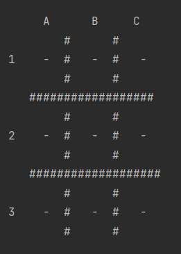
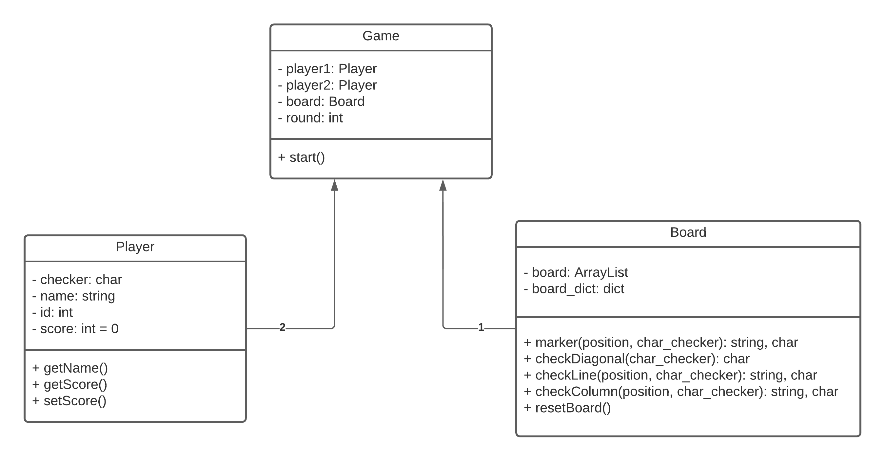

# Version: 1.0.0

## Início:

Nesta versão, o usuário escolhe o nome do Jogador 1 e o seu marcador que pode ser 'X' ou '0', a escolha é feita
atravéz do ID do marcador: '1' para 'X' e '2' para 'O'.

ID | Marcador
---|---------
 1 |    X
 2 |    O

Apos escolher o nome e o marcador do Jogador 1, é feita a escolha do nome do Jogador 2 e ele automaticamente fica com
o marcador que sobrou.

Depois de escolher os nomes e os marcadores dos jogadores, é feito a escolha do número de rodadas.

Com tudo definido, inicia-se a primeira rodada.
Os jogadores que fazem a primeira jogada alternam em cada jogada, a primeira rodada é sempre indicada com o Jogador 1.

A escolha da posição do marcador no tabuleiro é feita por meio de coordenadas.
 O formato de entrada segue o padrão de exemplo 'A1' (coluna/linha).

O tabuleiro é representado em uma matriz 3x3 que pode ser visualizado na imagem seguinte:

A fim de cada rodada é mostrado um placar com o score de cada jogador, se a partida possuir um vencedor, é atribuído +1 a
pontuação do jogador vencedor da partida.

## Diagrama de classe:

